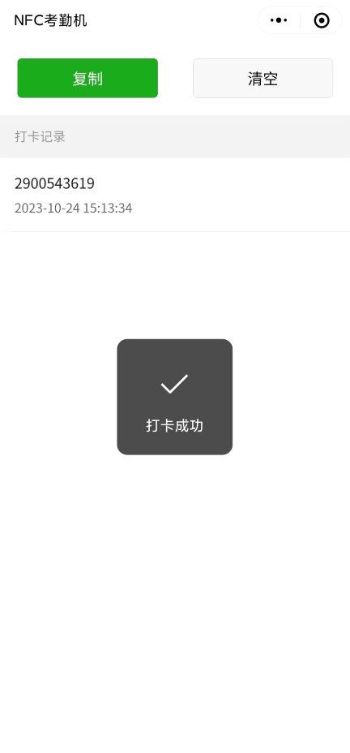

# UID batch reader

UID Batch Reader 是一个用于苏州大学计算机学院学生活动考勤的小程序。它允许用户使用手机轻松记录学生卡的UID以完成考勤操作。

## 安装

使用微信扫描以下小程序码：

## 使用说明

1. 打开小程序，确保您的微信已登录。
2. 将学生卡靠近手机，小程序将自动读取卡片的UID。
3. 批量考勤完成后，单击“复制”按钮将考勤记录复制到剪贴板。

## 系统要求

- 仅支持搭载NFC设备的Android系统手机

## 示例

## 常见问题解答（FAQ）

- **问题1：我的手机满足小程序的系统要求，为什么依然提示该机型不支持NFC？**
  - 答：这是小程序目前存在的一个小bug，忽略就好 :)

- **问题2：如何导出考勤记录？**
  - 答：单击“复制”按钮将考勤记录复制到剪贴板，然后可以在另外的地方粘贴以完成记录的导出。

- **问题3：我的学生卡不被读取，怎么办？**
  - 答：请确保手机具备NFC功能并且开启NFC读取，且小程序获得了必要的权限。
